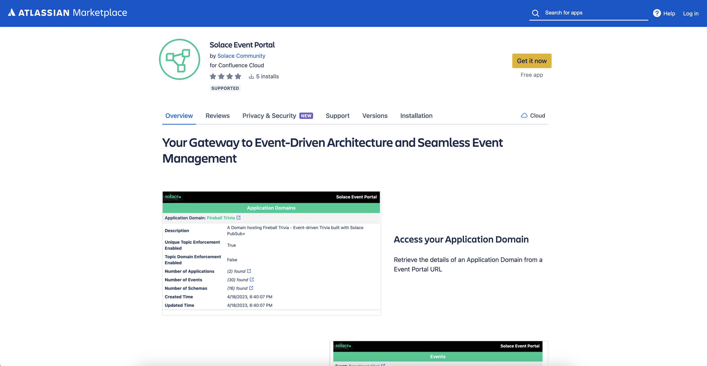
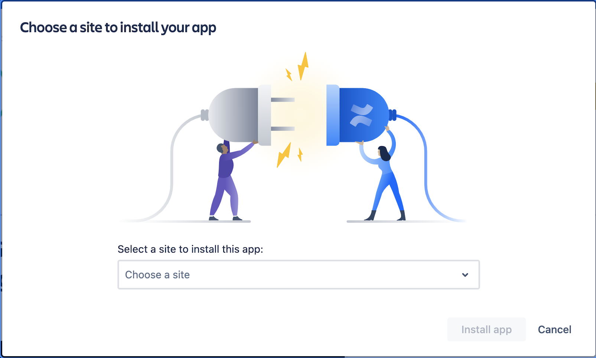

## Introduction

Confluence is a team workspace where knowledge and collaboration meet. Dynamic pages give your team a place to create, capture, and collaborate on any project or idea. Integration of Solace Event Portal and Confluence benefits the entire team to collaborate on the EDA solution. The goal is to create a Confluence app that enables Confluence users to query Event Portal resources using Event Portal REST API and render it for visual consumption. The Confluence app interactions would allow users to query and navigate to resource versions and other resources referred in the context by unfurling an Event Portal URL.

Confluence app interactions exposes a read-only view of the EP artifacts and utilizes Confluence's Forge UI components for building nice visual layouts and components. The current release of the Solace Event Portal App supports the following EP resources - Application Domains, Applications, Events, Schemas, Enums, Event APIs and Event API Products. The scope and details of coverage will continue to expand with the enhancements to the REST API.

It should be noted that the access to Event Portal is incumbent upon a valid REST API Token, a Confluence user must register a valid API Token to access Event Portal app features.  

The Solace Event Portal Confluence app is available on the Atlassian Marketplace. Any one with admin privilege on their Confluence instance can fetch and install with a single-click. 

## Install Solace Event Portal App for Confluence
Solace Event Portal App for Confluence can be installed on a Confluence workspace by the Confluence Administrator (or a user with appropriate privileges). 

1. Follow the link to install [Solace Event Portal app from Atlassian Marketplace](https://marketplace.atlassian.com/apps/1230432/solace-event-portal?hosting=cloud&tab=overview).
2. This will open a page displaying the set of required permissions and a button to get the app.

1. Click on the **Get it now** button to proceed with the installation. 
2. Choose the site you want to install the app on from the drop-down list and click on **Install** button. 

1. Accept and grant permissions as requested to complete the installation.
 
The App is now available for all users of the site. As a Confluence Administrator, completing steps 1-5 would install the Solace Event Portal and make it accessible to all site users. 

Refer to the [User Guide](user-guide.md) on how to use the Solace Event Portal app for Confluence.

# Resources

*For more information, try these resources:*

Event Portal App for Confluence - [User Guide](user-guide.md)

Event Portal 2.0 [Overview](https://docs.solace.com/Cloud/Event-Portal/event-portal-overview.htm)

Event Portal Open API Documentation - [Event Portal REST API v2](https://openapi-v2.solace.cloud/)

Event Portal REST API Reference - [Using REST APIs for PubSub+ Cloud](https://api.solace.dev/cloud/reference/using-the-v2-rest-apis-for-pubsub-cloud)

Report issues & request for enhancements - [GitHub Issues](https://github.com/SolaceLabs/solace-confluence-forge-app/issues)

Ask the Solace [Community](https://solace.community/)
