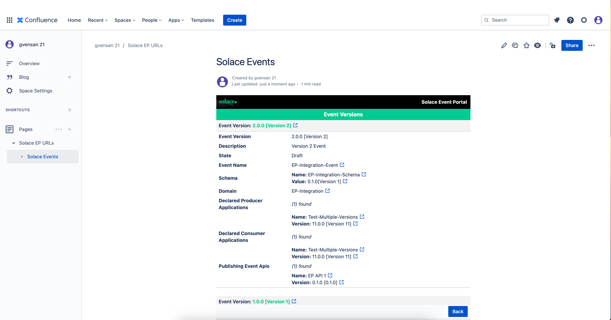

## Introduction

Confluence is a team workspace where knowledge and collaboration meet. Dynamic pages give your team a place to create, capture, and collaborate on any project or idea. Integration of Solace Event Portal and Confluence benefits the entire team to collaborate on the EDA solution. The goal is to create a Confluence app that enables Confluence users to query Event Portal resources using Event Portal REST API and render it for visual consumption. The Confluence app interactions would allow users to query and navigate to resource versions and other resources referred in the context by unfurling an Event Portal URL.

Confluence app interactions exposes a read-only view of the EP artifacts and utilizes Confluence's Forge UI components for building nice visual layouts and components. The current release of the Solace Event Portal App supports the following EP resources - Application Domains, Applications, Events, Schemas, Enums, Event APIs and Event API Products. The scope and details of coverage will continue to expand with the enhancements to the REST API.

It should be noted that the access to Event Portal is incumbent upon a valid REST API Token, a Confluence user must register a valid API Token to access Event Portal app features.  

### About Solace Event Portal App

The Solace Event Portal app has two components
* REST API Token Manager app to manage API tokens and
* Event Portal macro to interact with Event Portal using REST APIs on a page

### Register API Token
1. Select the **Solace Event Portal Token Manager** app from the *Apps* menu item on the top of the page.

2. It will open a page requesting permission to grant permission to access Confluence on behalf of a user. Click on **Allow access** button.

1. You will be presented with a listing of specific permissions that will be granted to the app in Confluence - click on the **Allow** button at the bottom of the page.

1. Voila, you are done! You will be automatically redirected to API Token Manager page where you can enter your API Token to get started.

1. Go ahead, and click on the **Register** button. In the popup, enter your API Token and submit. To know more about REST API tokens for using Solace PubSub+ Cloud, refer to [documentation](https://docs.solace.com/Cloud/ght_api_tokens.htm)

*NOTE:* You can change/update the token anytime by relaunching the *Solace Event Portal Token Manager* app from the Apps list and clicking on the **Update** button.

### Working with Solace Event Portal Macro

1. Open an existing page in edit mode or create new page, and enter '/' (slash) in the page to bring up the list of macros. Select the *Solace Event Portal* available in the macros list. 

2. A tile layout will appear with a series of buttons at the bottom, if the buttons doesn't appear - just click on the tile. Click on the *pencil* icon.

3. You will see a configuration sidebar opening up on the left with an empty textarea. Paste the Event Portal URL in the text area and click anywhere outside the sidebar.

4. You will now see the macro at work - it unfurls the URL and fetches the Event Portal resource details captured in the URL.

*NOTE*: You are still in the page _Edit_, the displayed information is not interactive. It is just a preview! Go ahead and click on publish by clicking on the **Publish** button at the top-right of the page.

Here is what is presented in the App view - Resource details, Context (Domain, Application as applicable) and a button to access resource versions.

5. By clicking on the **Fetch Versions** button, you would be able to retrieve and view the resource versions.

### API Token permissions

Solace Event Portal macro fetches contextual details like the Domain, Application a resource belongs to, along with the child resources like Versions and others (depending on the resource type). An API Token holds granular set of permissions to access distinct resource type. 

* If the API Token does not have permission to fetch information on the resource captured by the Event Portal URL, an appropriate error message is displayed.

* If the API Token does not have permission to access parent resources in context, for example lack of permission to access Domain or Application accessing an Event (say), those details will be skipped and only the resources details will be rendered.

* In the case of child resources, if the API Token does not have permission to access Versions, simply the count of versions will be presented.
*  or Event API (say) in the case of Event API Products - a simple count of available child resource gets mentioned.

In essence, what you see is dependent on the permissions granted on the API Token - no error will be thrown. 

#### Usage Tips

* Clicking on the  icon, opens the Event Portal resource link.
* Clicking on **Fetch Versions** button would fetch the resource versions.
* A default page size of 5 is employed, meaning 5 resources are presented in a single page without pagination. If the count of resources exceeds 5, the pagination facility  automatically kicks in and presents the UI controls for page navigation.
* If you are viewing child resources (like versions), you can go back to the parent resource by clicking on the **Back** button at the bottom bar.
* When presenting contained/referenced resource, a count information is shared first and then the content is expanded. 
* The bottom bar contains the original Event Portal URL as entered while configuring the macro. 

# Resources

*For more information, try these resources:*

Event Portal App for Confluence - [Installation Guide](installation-guide.md)

Event Portal 2.0 [Overview](https://docs.solace.com/Cloud/Event-Portal/event-portal-overview.htm)

Event Portal Open API Documentation - [Event Portal REST API v2](https://openapi-v2.solace.cloud/)

Event Portal REST API Reference - [Using REST APIs for PubSub+ Cloud](https://api.solace.dev/cloud/reference/using-the-v2-rest-apis-for-pubsub-cloud)

Report issues & request for enhancements - [GitHub Issues](https://github.com/SolaceLabs/solace-confluence-forge-app/issues)

Ask the Solace [Community](https://solace.community/)